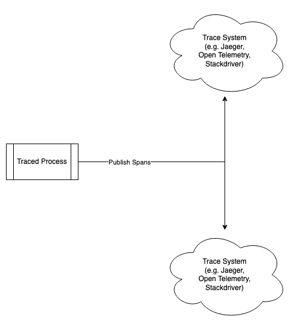
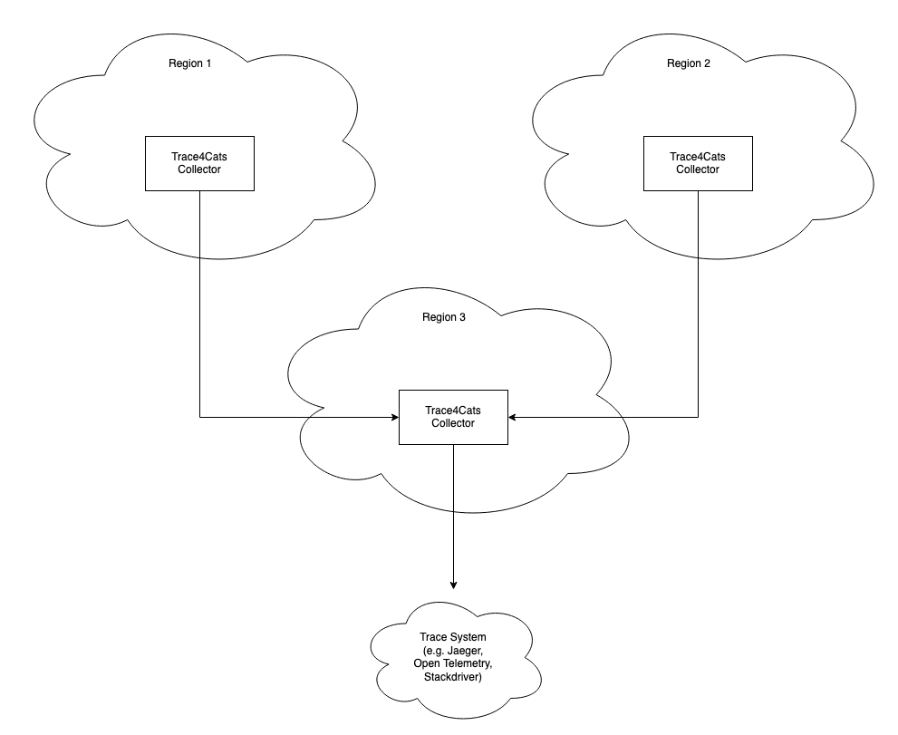
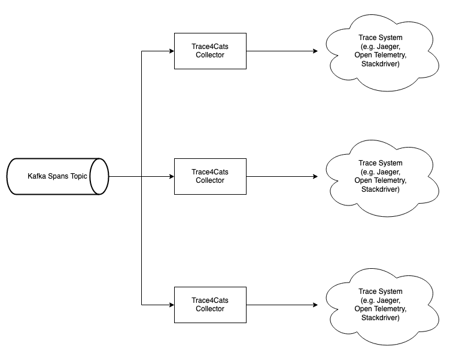

# Topologies

Trace4cats components can be arranged in a number of differing ways. Either in point-to-point configurations using UDP
and TCP connections, or message based configurations using [Kafka].

  * [Point to Point](#point-to-point)
    + [Simple](#simple)
    + [Multi Export](#multi-export)
    + [Agent](#agent)
    + [Collector Only](#collector-only)
    + [Collector Forwarding](#collector-forwarding)
  * [Kafka](#kafka)
    + [Simple](#simple-1)
    + [Agent](#agent-1)
    + [Collector Only](#collector-only-1)
    + [Collector Forwarding](#collector-forwarding-1)
    + [Multi Collector](#multi-collector)

## Point to Point

As mentioned above, point-to-point topologies rely on UDP and TCP connections and load balancers.

### Simple

In a simple configuration the Trace4Cats library can export directly to a tracing system. Please note that this may
inhibit your ability in using Graal [`native-image`] to compile your code.

### Multi Export

As mentioned in the [readme](../README.md#spanexporter-and-spancompleter), `SpanExporter`s and `SpanCompleter`s may be 
combined using its monoid instance. See the 
[`AllCompleters` example](../modules/example/src/main/scala/io/janstenpickle/trace4cats/example/AllCompleters.scala) 
for details.

### Agent

The Trace4Cats [agent] is designed to be co-located with the traced application, either on the same machine or as a
[Kubernetes sidecar](https://www.magalix.com/blog/the-sidecar-pattern). The [agent] can only forward via TCP to a
collector. 

### Collector Only

The Trace4Cats library can be configured to send directly to the [collector] via TCP or UDP. While not shown on the
diagram, you can deploy multiple instances of the [collector] behind a load balancer (like in a Kubernetes deployment
and service).

### Collector Forwarding

The [collector] can be [configured](configuration.md) forward on to other collectors. This may be useful if you have
multi-region setup where the [collector] within a region may perform [sampling](sampling.md) before forwarding to an
aggregating collector.

## Kafka

When using Trace4Cats with [Kafka], you can do a few more interesting things than with point-to-point connections.
The Kafka exporter guarantees that all spans for a single trace will end up on the same topic partition, making
collector load balancing and [sample decisions](sampling.md) easier.

### Simple

In a simple configuration, the Trace4Cats library can export directly to Kafka.

### Agent

Similar to [above](#agent), [agent-kafka] can be used as a sidecar to send spans directly to [Kafka], without having to
use the [Kafka] client within your app.

### Collector Only

The Trace4Cats library can be configured to send spans directly to [Kafka], note this does mean that ad dependency on
the [Kafka] client will be introduced to your app.

### Collector Forwarding

Collectors within different regions may forward to a multi-region [Kafka] topic, where all spans are then forwarded to
a trace system by another collector, or group of collectors using the same consumer group.

### Multi Collector

Another potential [Kafka] based topology is where multiple collectors all consume from the same topic with different
consumer groups. Each [collector] could forward to a different trace system, and may have different 
[sampling](sampling.md) and [filtering](filtering.md) configuration.

[Kafka]: https://kafka.apache.org/
[`native-image`]: https://www.graalvm.org/docs/reference-manual/native-image/ 
[collector]: ../components#collector
[agent]: ../components#agent
[agent-kafka]: ../components#agent-kafka